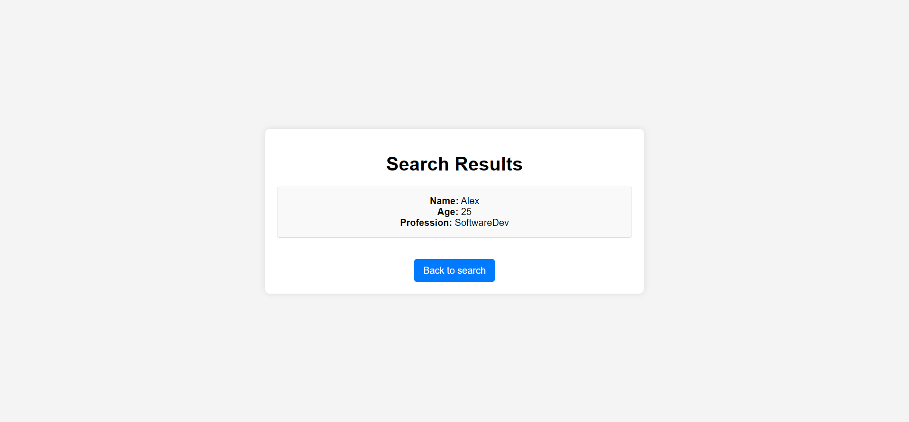
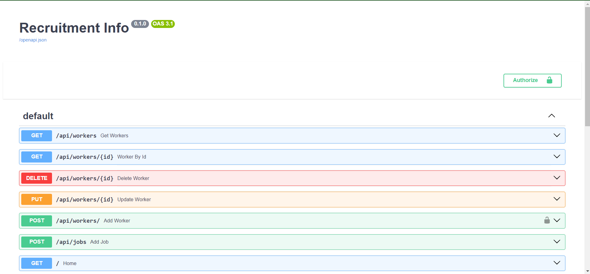

# FastAPI CRM Recrutio
___

## Technology Stack and Features
___
- ⚡ **FastAPI** for the Python backend API.
- 🧰 **SQLModel** for the Python SQL database interactions (ORM).
- 🔍 **Pydantic**, used by FastAPI, for data validation and settings management.
- 💾 **SQLite** as the SQL database.
- 🚀 **Jinja2** for templating in the frontend.
- 🧩 **OAuth2** for secure authentication.
- 📋 CRUD operations for managing worker and job records.
- 🔐 Secure password hashing with **passlib**.
- 🌐 Interactive API documentation with **Swagger UI**.
- 🔧 Automated testing with **Pytest**.


### Search Page

### Search Results

### Authorization

### SwaggerUI



## Installation and Deployment

1. Clone the repo / open archive:
   ```sh
   git clone https://github.com/AlexPrograms/fastApiProjectLearning
Or you can use UI of your IDE.

2. Create a Virtual Environment if needed
3. Activate the Virtual Environment
4. Install Project Dependencies:
Use UI and install such packages: fastapi, uvicorn,
sqlmodel,
pydantic,
passlib,
sqlalchemy,
jinja2

Or use terminal, for instance: 
```sh
pip install fastapi
````

5. Verify Installation if needed
```sh
pip list
````
## Credentials for auth
- login: hello
- password: hello